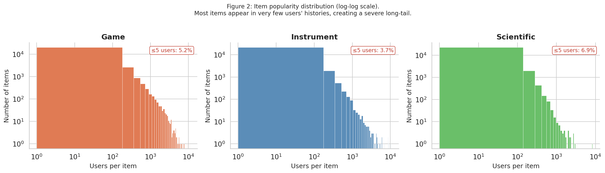
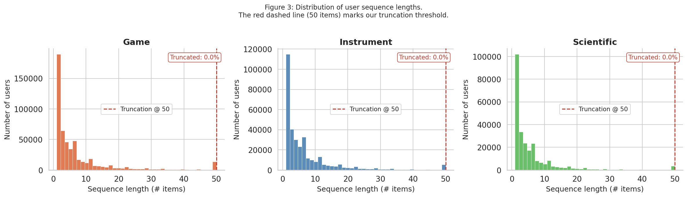

# SEARec_Data_Analysis Exported Outputs

Source notebook: `SEARec_Data_Analysis.ipynb`

## Cell 3

`# ── Core libraries ──────────────────────────────────────────────────────────`

### Text Output 1

~~~text
Libraries loaded.
~~~

## Cell 6

`# ── Download & unzip dataset from Google Drive folder ─────────────────`

### Text Output 1

~~~text
Retrieving folder contents
~~~

### Text Output 2

~~~text
Processing file 1Eeke05HwZuSYtzxaO1q5_Rh6iQC_Eb3q game.zip
Processing file 1_SM_UqZg6EYrxwV27r6Muc_Guioz7P3J instrument.zip
Processing file 1vaeHLpgIfk0WvxuanKQ4LcHvQZ2sg-Px scientific.zip
~~~

### Text Output 3

~~~text
Retrieving folder contents completed
Building directory structure
Building directory structure completed
Downloading...
From (original): https://drive.google.com/uc?id=1Eeke05HwZuSYtzxaO1q5_Rh6iQC_Eb3q
From (redirected): https://drive.google.com/uc?id=1Eeke05HwZuSYtzxaO1q5_Rh6iQC_Eb3q&confirm=t&uuid=b6b4205b-9222-41c5-8172-dcaf7c9885ff
To: /content/ETEGRec_datasets/game.zip
100%|██████████| 48.9M/48.9M [00:00<00:00, 71.3MB/s]
Downloading...
From (original): https://drive.google.com/uc?id=1_SM_UqZg6EYrxwV27r6Muc_Guioz7P3J
From (redirected): https://drive.google.com/uc?id=1_SM_UqZg6EYrxwV27r6Muc_Guioz7P3J&confirm=t&uuid=0c378c6f-4071-4d2f-84c5-eeb478aab5f1
To: /content/ETEGRec_datasets/instrument.zip
100%|██████████| 40.3M/40.3M [00:00<00:00, 74.7MB/s]
Downloading...
From (original): https://drive.google.com/uc?id=1vaeHLpgIfk0WvxuanKQ4LcHvQZ2sg-Px
From (redirected): https://drive.google.com/uc?id=1vaeHLpgIfk0WvxuanKQ4LcHvQZ2sg-Px&confirm=t&uuid=c50579a2-71c8-4f87-b90f-9e36fbe52c6a
To: /content/ETEGRec_datasets/scientific.zip
100%|██████████| 38.9M/38.9M [00:00<00:00, 50.0MB/s]
Download completed
~~~

### Text Output 4

~~~text
Unzipping ./ETEGRec_datasets/game.zip...
Unzipping ./ETEGRec_datasets/scientific.zip...
Unzipping ./ETEGRec_datasets/instrument.zip...
Done. Contents:
  ./ETEGRec_datasets/instrument/256-512-256-128.rqvae.pth
  ./ETEGRec_datasets/instrument/instrument.test.jsonl
  ./ETEGRec_datasets/instrument/instrument_emb_256.npy
  ./ETEGRec_datasets/instrument/instrument.valid.jsonl
  ./ETEGRec_datasets/instrument/instrument.train.jsonl
  ./ETEGRec_datasets/instrument/instrument.emb_map.json
  ./ETEGRec_datasets/game/game.train.jsonl
  ./ETEGRec_datasets/game/256-512-256-128.rqvae.pth
  ./ETEGRec_datasets/game/game.test.jsonl
  ./ETEGRec_datasets/game/game.emb_map.json
  ./ETEGRec_datasets/game/game.valid.jsonl
  ./ETEGRec_datasets/game/game_emb_256.npy
  ./ETEGRec_datasets/scientific/scientific.train.jsonl
  ./ETEGRec_datasets/scientific/256-512-256-128.rqvae.pth
  ./ETEGRec_datasets/scientific/scientific_emb_256.npy
  ./ETEGRec_datasets/scientific/scientific.valid.jsonl
  ./ETEGRec_datasets/scientific/scientific.test.jsonl
  ./ETEGRec_datasets/scientific/scientific.emb_map.json
~~~

## Cell 8

`DATA_ROOT = Path("./ETEGRec_datasets")`

### Text Output 1

~~~text
        game  →  ETEGRec_datasets/game  (3 .jsonl files)
  instrument  →  ETEGRec_datasets/instrument  (3 .jsonl files)
  scientific  →  ETEGRec_datasets/scientific  (3 .jsonl files)
~~~

## Cell 10

`def load_jsonl(path: Path) -> list[dict]:`

### Text Output 1

~~~text
        game  train=530,300  test=94,762
  instrument  train=339,519  test=57,439
  scientific  train=259,992  test=50,985
~~~

## Cell 13

`for ds in DATASETS:`

### Text Output 1

~~~text
============================================================
  Dataset: GAME  -  first 2 training records
============================================================
{
  "user_id": "AEVPPTMG43C6GWSR7I2UGRQN7WFQ",
  "target_id": "B0863MT183",
  "inter_history": [
    "B08R5B7YS4"
  ]
}
...
{
  "user_id": "AEVPPTMG43C6GWSR7I2UGRQN7WFQ",
  "target_id": "B08P8P7686",
  "inter_history": [
    "B08R5B7YS4",
    "B0863MT183"
  ]
}
...

============================================================
  Dataset: INSTRUMENT  -  first 2 training records
============================================================
{
  "user_id": "AHV6QCNBJNSGLATP56JAWJ3C4G2A",
  "target_id": "B00O4VH9YG",
  "inter_history": [
    "B00OG187HC"
  ]
}
...
{
  "user_id": "AHV6QCNBJNSGLATP56JAWJ3C4G2A",
  "target_id": "B003LPTAYI",
  "inter_history": [
    "B00OG187HC",
    "B00O4VH9YG"
  ]
}
...

============================================================
  Dataset: SCIENTIFIC  -  first 2 training records
============================================================
{
  "user_id": "AFNT6ZJCYQN3WDIKUSWHJDXNND2Q",
  "target_id": "B098BR67DJ",
  "inter_history": [
    "B00DX7KEP8"
  ]
}
...
{
  "user_id": "AFNT6ZJCYQN3WDIKUSWHJDXNND2Q",
  "target_id": "B08Y97BK7N",
  "inter_history": [
    "B00DX7KEP8",
    "B098BR67DJ"
  ]
}
...
~~~

## Cell 15

`for ds in DATASETS:`

### Text Output 1

~~~text
GAME - schema keys (from 530,300 train records):
  user_id                    present in 530,300 / 530,300 records
  target_id                  present in 530,300 / 530,300 records
  inter_history              present in 530,300 / 530,300 records

INSTRUMENT - schema keys (from 339,519 train records):
  user_id                    present in 339,519 / 339,519 records
  target_id                  present in 339,519 / 339,519 records
  inter_history              present in 339,519 / 339,519 records

SCIENTIFIC - schema keys (from 259,992 train records):
  user_id                    present in 259,992 / 259,992 records
  target_id                  present in 259,992 / 259,992 records
  inter_history              present in 259,992 / 259,992 records
~~~

## Cell 19

`seq_lengths = {}  # ds -> list of lengths`

### Text Output 1

~~~text
GAME - sequence length:
  mean=7.7  median=4  min=1  max=50
  p90=19  p95=32    truncated (>50): 0.0%

INSTRUMENT - sequence length:
  mean=7.4  median=4  min=1  max=50
  p90=18  p95=27    truncated (>50): 0.0%

SCIENTIFIC - sequence length:
  mean=6.3  median=3  min=1  max=50
  p90=14  p95=23    truncated (>50): 0.0%
~~~

## Cell 23

`user_counts = {}   # ds -> Counter(user_id -> n_interactions)`

### Text Output 1

~~~text
        GAME | avg interactions/user=43.0 | avg users/item=160.63 | items with only 1 user: 0.8%
  INSTRUMENT | avg interactions/user=43.8 | avg users/item=102.70 | items with only 1 user: 0.6%
  SCIENTIFIC | avg interactions/user=32.2 | avg users/item=64.22 | items with only 1 user: 0.9%
~~~

## Cell 27

`summary_rows = []`

### Text Output 1

~~~text
Dataset Summary Table
=====================================================================================
            #Users  #Items #Interactions Density (%) Avg seq len Avg inter/user Avg users/item
Dataset                                                                                       
Game        94,762  25,612     4,072,490     0.16780        7.68          42.98         160.63
Instrument  57,439  24,587     2,513,478     0.17798         7.4          43.76          102.7
Scientific  50,985  25,848     1,640,198     0.12446        6.31          32.17          64.22
~~~

### Rich Output 2

*Table 1: Dataset statistics after 5-core filtering.*

| Dataset | #Users | #Items | #Interactions | Density (%) | Avg seq len | Avg inter/user | Avg users/item |
| --- | --- | --- | --- | --- | --- | --- | --- |
| Game | 94,762 | 25,612 | 4,072,490 | 0.16780 | 7.68 | 42.98 | 160.63 |
| Instrument | 57,439 | 24,587 | 2,513,478 | 0.17798 | 7.4 | 43.76 | 102.7 |
| Scientific | 50,985 | 25,848 | 1,640,198 | 0.12446 | 6.31 | 32.17 | 64.22 |

## Cell 29

`fig, axes = plt.subplots(1, 3, figsize=(16, 4.5), sharey=False)`

### Image Output 1

### Text Output 2

~~~text
Saved: fig1_user_interaction_dist.pdf / .png
~~~

## Cell 32

`fig, axes = plt.subplots(1, 3, figsize=(16, 4.5), sharey=False)`

### Image Output 1

### Text Output 2

~~~text
Saved: fig2_item_popularity_dist.pdf / .png
~~~

## Cell 35

`fig, axes = plt.subplots(1, 3, figsize=(16, 4.5), sharey=False)`

### Image Output 1

### Text Output 2

~~~text
Saved: fig3_seq_length_dist.pdf / .png
~~~

## Cell 38

`ds_labels   = [ds.capitalize() for ds in DATASETS]`

### Image Output 1

### Text Output 2

~~~text
Saved: fig4_sparsity_catalog.pdf / .png
~~~

## Cell 41

`def lorenz_curve(counts: np.ndarray):`

### Text Output 1

~~~text
/tmp/ipykernel_4714/2482630722.py:19: DeprecationWarning: `trapz` is deprecated. Use `trapezoid` instead, or one of the numerical integration functions in `scipy.integrate`.
  gini = 1 - 2 * np.trapz(y, x)
~~~

### Text Output 2

~~~text
        Game - Gini coefficient (item popularity): 0.6916
  Instrument - Gini coefficient (item popularity): 0.6202
  Scientific - Gini coefficient (item popularity): 0.5870
~~~

### Image Output 3

### Text Output 4

~~~text
Saved: fig5_lorenz_curve.pdf / .png
~~~

## Cell 52

`print(r"""`

### Text Output 1

~~~text
% Paste this into your neurips_2026.tex (Experiments > Datasets section)
\begin{table}[h]
  \caption{Dataset statistics after 5-core filtering and leave-one-out split.}
  \label{tab:data}
  \centering
  \small
  \begin{tabular}{lrrrrr}
    \toprule
    Dataset & \#Users & \#Items & \#Interactions & Density (\%) & Avg.~seq~len \\\\
    \midrule

    Game         &  94,762 &     25,612 &    4,072,490 & 0.16780 &   7.68 \\
    Instrument   &  57,439 &     24,587 &    2,513,478 & 0.17798 &    7.4 \\
    Scientific   &  50,985 &     25,848 &    1,640,198 & 0.12446 &   6.31 \\

    \bottomrule
  \end{tabular}
\end{table}

% Narrative template for the Datasets paragraph:

% Game
% 94,762 users, 25,612 items, density 0.16780%.
% Avg sequence length 7.68, avg 42.98 interactions per user.

% Instrument
% 57,439 users, 24,587 items, density 0.17798%.
% Avg sequence length 7.4, avg 43.76 interactions per user.

% Scientific
% 50,985 users, 25,848 items, density 0.12446%.
% Avg sequence length 6.31, avg 32.17 interactions per user.
~~~
